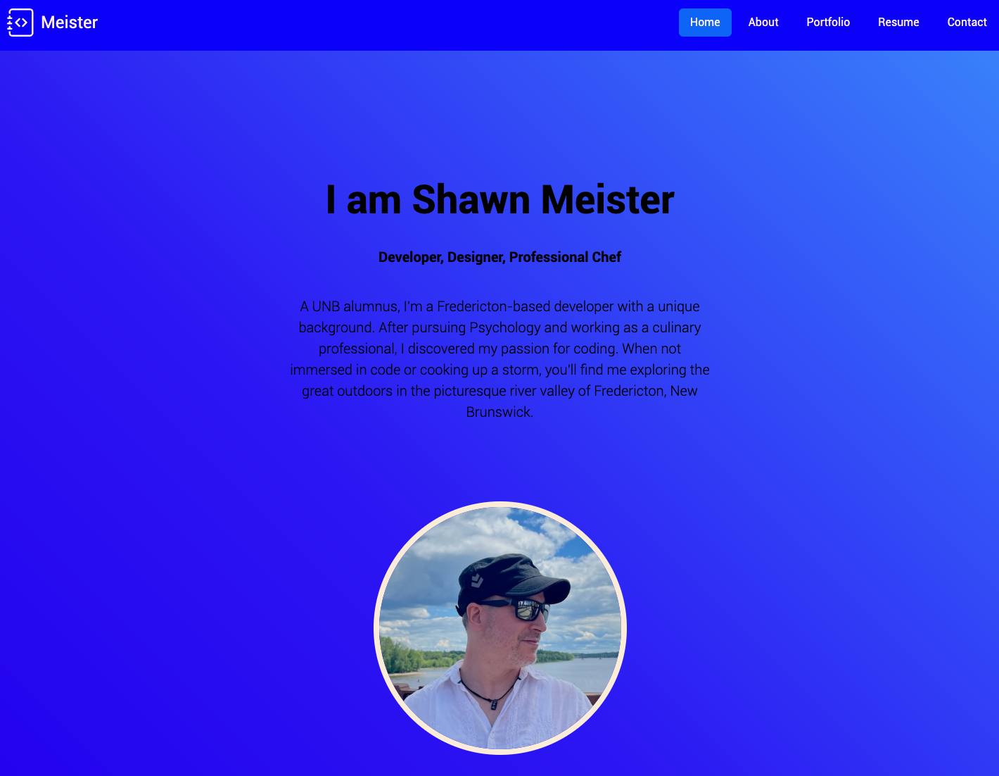

# meister-react-portfolio

[](https://opensource.org/licenses/mit)

## Table of Contents

- [Description](#description)
- [Features](#features)
- [Installation](#installation)
- [Usage](#usage)
- [Technologies](#technologies)
- [Screenshot](#screenshot)
- [Link](#link)
- [Contributing](#contributing)
- [Credits](#credits)
- [Questions](#questions)
- [License](#license)

## Description

This is a portfolio website built using React.js to showcase my web development projects and skills. It provides an interactive and user-friendly interface to explore my work and learn more about me.

## Features

- Responsive design for optimal viewing on various devices
- Navigation menu for easy access to different sections
- Project showcase with descriptions, images, and links
- About me section highlighting my skills and experience
- Contact form for potential clients or collaborators to reach out

## Installation

1. Clone the repository:

   ```
   git clone https://github.com/CookingMeister/meister-react-portfolio.git
   ```

2. Navigate to the project directory:

   ```
   cd meister-react-portfolio
   ```

3. Install the dependencies:
   ```
   npm install
   ```

## Usage

1. Start the development server:

   ```
   npm start
   ```

2. Open your browser and visit `http://localhost:5173` to view the portfolio.

## Technologies

- React.js
- React Router
- Vite
- HTML5
- CSS3
- JavaScript
- Bootstrap

## Screenshot

The following image shows the web application's appearance and functionality:


## Link

A link to the deployed site can be found [here](https://main--warm-yeot-1ec485.netlify.app/).

## Contributing

Contributions are welcome! If you have any suggestions, bug reports, or feature requests, please open an issue or submit a pull request.

## Credits

This app was created by [CookingMeister](https://github.com/CookingMeister) on criteria from the University of New Brunswick's [edX Coding Bootcamp](https://unb.ca/cel/bootcamps/coding.html) program. Program materials, [MDN Web Docs](https://developer.mozilla.org/en-US/docs/Learn/Tools_and_testing/Client-side_JavaScript_frameworks/React_getting_started) and [React Router documentation](https://reactrouter.com/en/main) were referenced for this app.

## Questions

If you have an questions about this app, please contact me at [LinkedIn](https://www.linkedin.com/in/shawn-meister-bb646b29a/). More of my work can be viewed at [Github](https://github.com/CookingMeister).

## License

[](https://opensource.org/licenses/mit)

This project is licensed under the [MIT License](LICENSE).
